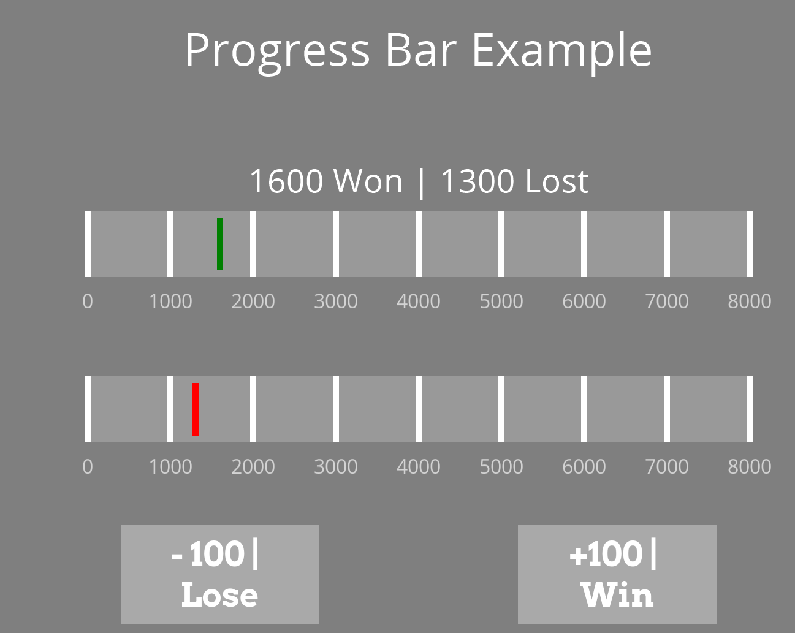

-----

#### Explanation:
At the start of the experiment, we set 2 variables, one for the wins and one for the loses:
```python
# Begin Experiment:
win_sum = 0
lose_sum = 0
```

We have two buttons in the experiment, one demonstrating wins (+100) and one demonstrating losses (-100). Whenever one of those buttons is pressed, we increase the corresponding variable by 100:
Win Button: `win_sum += 100`
Lose Button: `lose_sum += 100`

Whenever a new routine starts, we set the `win_lose` text to:
```python
$str(win_sum) + " Won | " + str(lose_sum) + " Lost"
```
Meaning we will get the updated variables in our text component.

-----
Now for the sliders.
We have a green slider (wins) and a red slider (loses).
And `readOnly` ticked so the participant won't be able to modify the slider.

At the start of each routine, we set the starting value of each slider to the corresponding sum:
```python
green.startValue= win_sum
red.startValue = lose_sum
```
